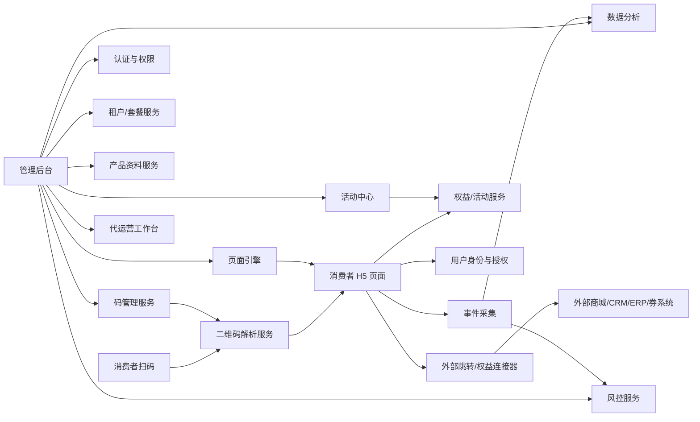
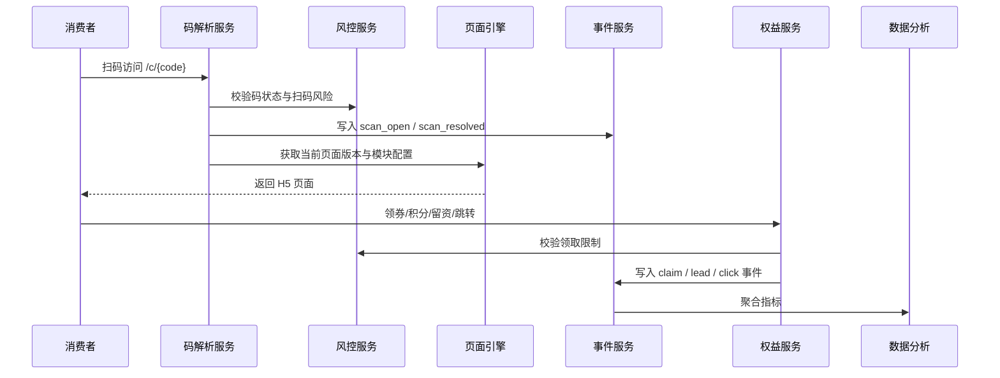

# 技术架构

## 1. 架构原则

- 多租户 SaaS 优先。
- 前后端分离。
- 消费者 H5 与管理后台分离。
- 码解析服务独立，保证高可用和低延迟。
- 页面引擎模块化，模板配置可版本化。
- 事件驱动埋点，方便分析与外部回流。
- 权益、风控、集成采用可插拔连接器设计。
- 公有云部署优先，预留专属租户和私有化扩展。

## 2. 推荐技术栈

> 以下为可替换建议，不锁死研发选择。

| 层 | 推荐 |
|---|---|
| 管理后台 | React / Next.js |
| 消费者 H5 | Next.js / React SSR 或轻量前端应用 |
| 后端 API | FastAPI / Node.js NestJS |
| 数据库 | PostgreSQL |
| 缓存 | Redis |
| 队列 | Redis Queue / RabbitMQ / Kafka，按规模选择 |
| 对象存储 | S3 兼容对象存储 / 阿里云 OSS / 腾讯云 COS |
| CDN | 云厂商 CDN |
| 搜索 | PostgreSQL FTS / OpenSearch，后期按需 |
| 日志监控 | OpenTelemetry + Prometheus/Grafana + 云日志 |
| 部署 | Docker + Nginx，后期 Kubernetes |
| AI 能力 | LLM API + 文档解析 + 人工审核工作流 |

## 3. 系统模块



## 4. 核心服务说明

### 4.1 二维码解析服务

职责：

- 接收扫码请求。
- 解析 code_id、campaign、channel、utm 参数。
- 校验码状态：存在、激活、冻结、作废、过期。
- 记录 scan_event。
- 调用风控规则。
- 决定跳转或渲染的页面版本。
- 防枚举、防爬、限流。

### 4.2 码管理服务

职责：

- 生成批次码、一物一码、内外码。
- 管理码批次、码段、码包。
- 支持导出印刷/标签/喷码文件。
- 管理码状态：生成、导出、印刷、待激活、激活、扫码、异常、冻结、作废。
- 支持既有码导入和接管。
- 绑定产品、SKU、批次、渠道、经销商、活动。

### 4.3 页面引擎

职责：

- 管理页面模板、行业模板、组件。
- 支持组件开关、排序、配置。
- 支持草稿、预览、发布、下线、版本和回滚。
- 支持活动期切换和场景动态展示。
- 支持中英文模板。

### 4.4 活动与权益服务

职责：

- 配置活动规则、时间、参与条件、预算。
- 管理优惠券、积分、礼品、抽奖、私域权益。
- 支持外部链接、券码池、API 发券。
- 权益领取、核销、兑换记录。
- 活动风控和领取限制。

### 4.5 数据与归因服务

职责：

- 采集扫码、页面、领券、留资、跳转、核销、异常等事件。
- 聚合经营看板、活动看板、渠道风控看板、区域品牌看板。
- 支持数据导出、外部成交导入、Webhook/API 回流。
- 支持归因规则：产品、批次、码、渠道、经销商、活动、页面、权益。

### 4.6 风控服务

职责：

- 首扫/重扫判断。
- 同码多地扫码预警。
- 跨区扫码预警。
- 权益领取频次限制。
- 设备/IP/手机号/地区/预算风控。
- 风险冻结、异常工单、预警通知。

### 4.7 集成中心

职责：

- 外部权益连接器：链接、口令、券码池、API 发券。
- 商城订单回流：API、Webhook、手动导入。
- 企微、公众号、小程序、电商店铺配置。
- CRM、会员系统、ERP、进销存、旧溯源系统数据导入/同步。
- 食链通/GTS 可选集成。

## 5. 多租户隔离建议

推荐采用共享数据库 + tenant_id 强隔离作为第一阶段方案：

- 所有业务表必须包含 tenant_id。
- 关键查询强制 tenant scope。
- 后台 API 基于 JWT/session 中的 tenant_id 和 organization_id 做授权。
- 文件存储按 tenant 分目录或 bucket prefix。
- 高级客户可升级为独立 schema / 独立数据库 / 专属租户。

## 6. 二维码短链设计

示例：

```text
https://qr.yimatong.cn/c/8F3K9Q2X
https://brand.yimatong.cn/c/8F3K9Q2X
https://scan.brand.com/c/8F3K9Q2X
```

要求：

- code_public_id 不能自增暴露。
- 支持签名或校验位。
- 可附加 campaign/channel/utm 参数。
- 永久可解析，页面内容通过规则和版本控制。
- 短链服务不可依赖后台重型查询，每次扫码必须低延迟。

## 7. 数据流



## 8. 高可用重点

- 解析服务和 H5 页面是消费者入口，必须优先保障可用性。
- 静态资源走 CDN。
- 页面模板发布后生成可缓存快照。
- 权益领取接口要有幂等键。
- 码导出、AI 识别、报表计算走异步任务。
- 事件写入采用缓冲队列，避免影响扫码页面响应。
