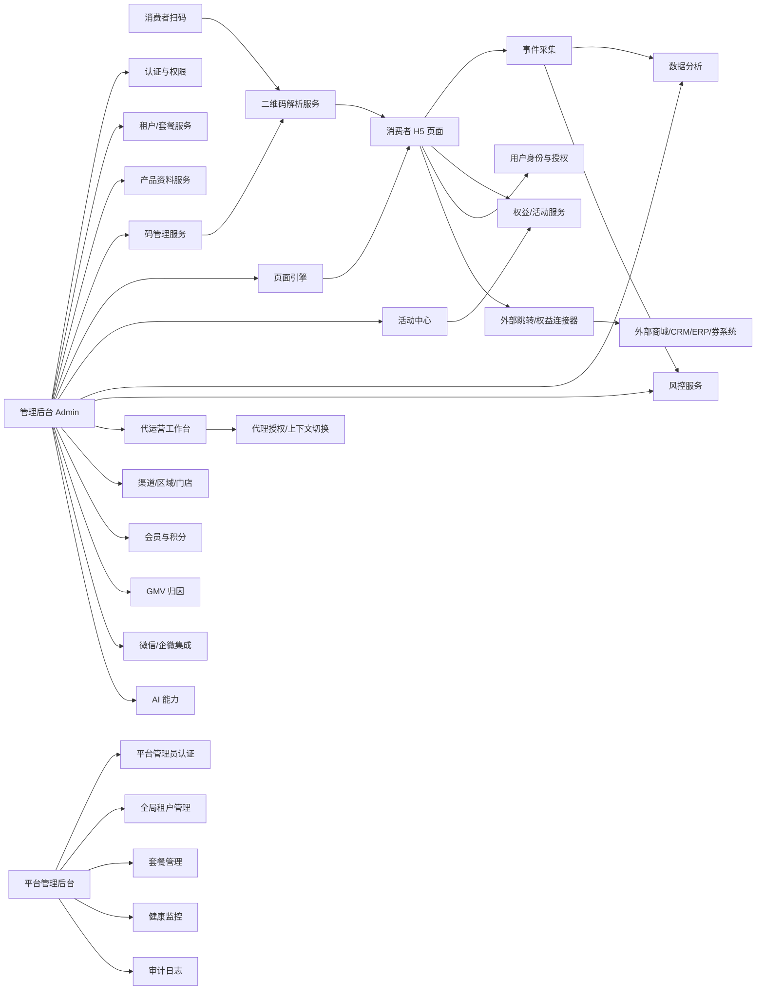
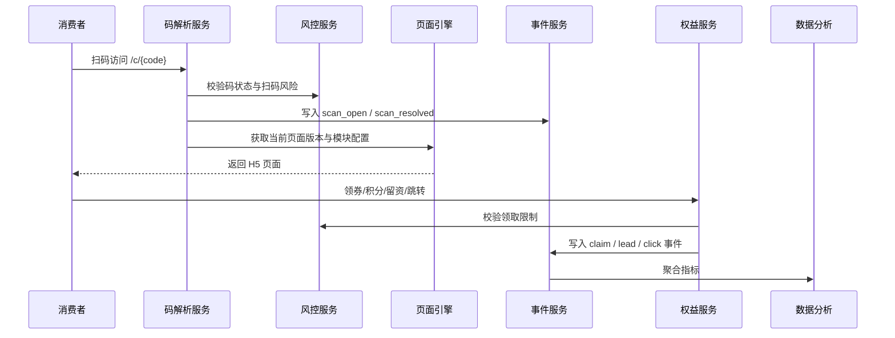

# 技术架构

## 1. 架构原则

- 多租户 SaaS 优先。
- 前后端分离。
- 消费者 H5 与管理后台分离。
- 码解析服务独立，保证高可用和低延迟。
- 页面引擎模块化，模板配置可版本化。
- 事件驱动埋点，方便分析与外部回流。
- 权益、风控、集成采用可插拔连接器设计。
- 公有云部署优先，预留专属租户和私有化扩展。

## 2. 实际技术栈

| 层 | 选型 |
|---|---|
| 管理后台（Admin） | Next.js App Router + Ant Design 6 + Zustand |
| 消费者 H5 | Next.js App Router + Tailwind CSS 4 + Headless UI |
| 平台管理后台（Platform） | Next.js App Router + Ant Design 6（独立 App，端口 3002） |
| 前端管理 | pnpm workspace monorepo |
| 后端 API | FastAPI（Python ≥3.12，uv 管理） |
| 数据库 | PostgreSQL 16（SQLAlchemy 2.0 async，Alembic 迁移） |
| 缓存/队列 | Redis 7（redis[hiredis]，arq 异步任务） |
| 对象存储 | MinIO（本地）/ S3 兼容（生产） |
| 测试 | pytest（后端）+ Playwright（前端 E2E） |
| 部署 | Docker Compose（开发/生产），后期 Kubernetes |

## 3. 系统模块



## 4. 核心服务说明

### 4.1 二维码解析服务

职责：

- 接收扫码请求。
- 解析 code_id、campaign、channel、utm 参数。
- 校验码状态：存在、激活、冻结、作废、过期。
- 记录 scan_event。
- 调用风控规则。
- 决定跳转或渲染的页面版本。
- 防枚举、防爬、限流。

### 4.2 码管理服务

职责：

- 生成批次码、一物一码、内外码。
- 管理码批次、码段、码包。
- 支持导出印刷/标签/喷码文件。
- 管理码状态：生成、导出、印刷、待激活、激活、扫码、异常、冻结、作废。
- 支持既有码导入和接管。
- 绑定产品、SKU、批次、渠道、经销商、活动。

### 4.3 页面引擎

职责：

- 管理页面模板、行业模板、组件。
- 支持组件开关、排序、配置。
- 支持草稿、预览、发布、下线、版本和回滚。
- 支持活动期切换和场景动态展示。
- 支持中英文模板。

### 4.4 活动与权益服务

职责：

- 配置活动规则、时间、参与条件、预算。
- 管理优惠券、积分、礼品、抽奖、私域权益。
- 支持外部链接、券码池、API 发券。
- 权益领取、核销、兑换记录。
- 活动风控和领取限制。

### 4.5 数据与归因服务

职责：

- 采集扫码、页面、领券、留资、跳转、核销、异常等事件。
- 聚合经营看板、活动看板、渠道风控看板、区域品牌看板。
- 支持数据导出、外部成交导入、Webhook/API 回流。
- 支持归因规则：产品、批次、码、渠道、经销商、活动、页面、权益。

### 4.6 风控服务

职责：

- 首扫/重扫判断。
- 同码多地扫码预警。
- 跨区扫码预警。
- 权益领取频次限制。
- 设备/IP/手机号/地区/预算风控。
- 风险冻结、异常工单、预警通知。

### 4.7 集成中心

职责：

- 外部权益连接器：链接、口令、券码池、API 发券。
- 商城订单回流：API、Webhook、手动导入。
- 企微、公众号、小程序、电商店铺配置。
- CRM、会员系统、ERP、进销存、旧溯源系统数据导入/同步。
- 食链通/GTS 可选集成。

## 5. 多租户隔离（已实现）

采用双重隔离：应用层 + PostgreSQL RLS。

- 所有业务表必须包含 tenant_id。
- **双重隔离**：应用层 `tenant_id` 过滤 + PostgreSQL RLS（`SET LOCAL app.tenant_id`）。
- **RLS 辅助函数**：`current_tenant_id()` 读取 `current_setting('app.tenant_id', true)`，返回 NULL 时放行所有行。
- **中间件**：`TenantScopeMiddleware` 从 JWT 提取 `tenant_id`，写入 context var → `get_db()` 在事务中 `SET LOCAL`。
- 公开路由跳过认证：`/api/v1/auth/login`、`/c/{public_id}`、`/health` 等。
- 后台 API 基于 JWT 中的 tenant_id 和 organization_id 做授权。
- 文件存储按 tenant 分目录。
- 高级客户可升级为独立 schema / 独立数据库 / 专属租户。

### 平台管理后台独立认证

- 独立登录端点：`/platform/auth/login`（非 `/auth/login`）
- 独立 cookie：`platform_access_token`（与 admin 的 `access_token` 隔离）
- 独立 auth store：`platform-auth.ts`（Zustand）
- 独立 axios 实例：读取 `platform_access_token`

### 代理授权系统

- 代运营机构通过 `agency_authorizations` 表获得对品牌客户的操作授权
- 支持上下文切换：`POST /agency/switch-context` → 代运营人员以客户身份操作
- 支持作用域控制：scope 指定可访问的模块（pages, campaigns, analytics 等）

## 6. 二维码短链设计

示例：

```text
https://qr.yimatong.cn/c/8F3K9Q2X
https://brand.yimatong.cn/c/8F3K9Q2X
https://scan.brand.com/c/8F3K9Q2X
```

要求：

- code_public_id 不能自增暴露。
- 支持签名或校验位。
- 可附加 campaign/channel/utm 参数。
- 永久可解析，页面内容通过规则和版本控制。
- 短链服务不可依赖后台重型查询，每次扫码必须低延迟。

## 7. 数据流



## 8. 高可用重点

- 解析服务和 H5 页面是消费者入口，必须优先保障可用性。
- 静态资源走 CDN。
- 页面模板发布后生成可缓存快照。
- 权益领取接口要有幂等键。
- 码导出、AI 识别、报表计算走异步任务。
- 事件写入采用缓冲队列，避免影响扫码页面响应。

## 9. 已实现的扩展模块

### 9.1 渠道与区域管理

- 经销商（Distributor）→ 区域（Region）→ 门店（Store）三级渠道体系
- 码流向登记（CodeAllocation）：记录码批次的渠道分配
- 窜货线索（DiversionClue）：自动检测跨区域扫码
- 经销商/门店入口（portal）：独立的扫码数据查看
- 账号渠道范围（AccountChannelScope）：控制操作员可见范围

### 9.2 会员与积分

- 消费者档案（ConsumerProfile）：匿名 ID + 微信 openid + 加密手机号
- 积分体系：积分规则（PointRule）、积分流水（PointTransaction）、积分商品（PointProduct）、积分兑换（PointRedemption）
- 会员等级标签系统

### 9.3 GMV 归因

- 外部订单导入（ExternalOrder）：按手机号哈希匹配扫码记录
- 归因引擎（GmvAttribution）：支持多种匹配类型和置信度评分
- 日统计聚合（GmvDailyStats）：按活动/渠道维度统计归因 GMV
- ROI 报表：扫码投入与成交产出的闭环分析

### 9.4 区域品牌/协会

- 区域组织管理（RegionalOrg）：独立的组织架构
- 白标配置（WhitelabelConfig）：自定义品牌名、颜色、Logo、字体
- 自定义域名（TenantDomain）：CNAME 接入 + SSL 管理
- 码规则（RegionalCodeRule）：组织级码前缀/规则配置
- 统一活动（UnifiedCampaign）：跨组织活动聚合

### 9.5 AI 能力

- 文案生成（copywriting）：基于 LLM 的产品/活动文案
- 图片识别（recognize-image）：产品信息提取
- 页面建议（page-suggest）：AI 推荐页面模块配置
- 所有 AI 生成记录存储在 ai_generations 表

### 9.6 外部集成

- **连接器系统**：Connector 抽象层，支持多种外部系统对接
- **券码池**：CouponPool + CouponCode 管理外部券码
- **权益投递**：BenefitDelivery 异步投递 + 重试机制
- **Webhook**：可配置的事件推送端点 + 投递重试
- **Open API**：`/open/v1/` 公开 API，供外部系统查询扫码/消费者/权益数据
- **企微集成**：WeComContactWay + WeComExternalContact 管理企微客户添加
- **微信 OAuth**：微信授权登录 + openid 绑定

### 9.7 平台管理后台

- 独立前端应用（`frontend/apps/platform/`，端口 3002）
- 独立认证体系（`platform_access_token` cookie）
- 全局租户管理、套餐管理、配额管理
- 租户健康监控（TenantHealthMetrics）
- 审计日志（PlatformAuditLog）

### 9.8 国际化

- 翻译管理（Translation）：按 key + locale 存储
- 语言检测（detect）：自动检测消费者语言
- 批量翻译导入

