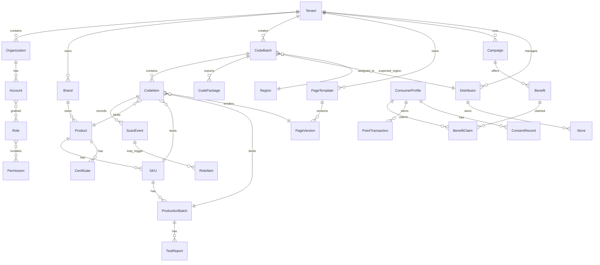
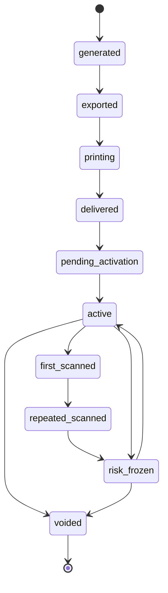
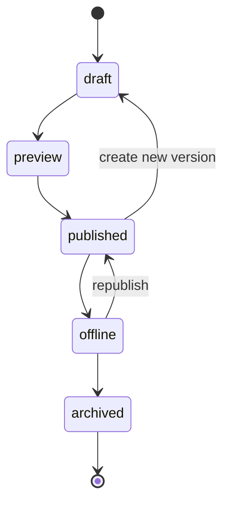

# 数据模型

## 1. 核心实体关系

## 2. 核心表

### tenants

| 字段 | 类型 | 说明 |
|---|---|---|
| id | uuid | 租户 ID |
| name | string | 租户名称 |
| tenant_type | enum | brand, regional_org, agency, platform |
| status | enum | trial, active, suspended, expired |
| plan_id | uuid | 套餐 |
| custom_domain | string | 客户自有域名 |
| created_at | datetime | 创建时间 |

### organizations

| 字段 | 类型 | 说明 |
|---|---|---|
| id | uuid | 组织 ID |
| tenant_id | uuid | 租户 |
| parent_id | uuid | 上级组织 |
| org_type | enum | platform, agency, regional_org, brand, distributor, store, print_partner |
| name | string | 组织名称 |
| status | enum | active, disabled |

### products

| 字段 | 类型 | 说明 |
|---|---|---|
| id | uuid | 产品 ID |
| tenant_id | uuid | 租户 |
| brand_id | uuid | 品牌 |
| name | string | 产品名称 |
| category | string | 品类 |
| origin | string | 产地 |
| description | text | 产品介绍 |
| status | enum | draft, active, archived |

### skus

| 字段 | 类型 | 说明 |
|---|---|---|
| id | uuid | SKU ID |
| product_id | uuid | 产品 |
| spec | string | 规格 |
| package_type | string | 包装类型 |
| barcode | string | 条形码/GTIN，可选 |
| image_url | string | 图片 |

### production_batches

| 字段 | 类型 | 说明 |
|---|---|---|
| id | uuid | 批次 ID |
| sku_id | uuid | SKU |
| batch_no | string | 批次号 |
| production_date | date | 生产日期 |
| expiry_date | date | 保质期截止 |
| origin | string | 产地 |
| status | enum | draft, active, archived |

### code_batches

| 字段 | 类型 | 说明 |
|---|---|---|
| id | uuid | 码批次 ID |
| tenant_id | uuid | 租户 |
| code_type | enum | batch_code, item_code, outer_inner_pair, box_code |
| quantity | int | 数量 |
| product_id | uuid | 产品 |
| sku_id | uuid | SKU |
| production_batch_id | uuid | 生产批次 |
| campaign_id | uuid | 活动 |
| expected_region_id | uuid | 预期销售区域 |
| distributor_id | uuid | 经销商 |
| status | enum | generated, exported, printing, delivered, pending_activation, active, frozen, voided |
| created_by | uuid | 创建人 |
| created_at | datetime | 创建时间 |

### code_items

| 字段 | 类型 | 说明 |
|---|---|---|
| id | uuid | 内部 ID |
| tenant_id | uuid | 租户 |
| code_batch_id | uuid | 码批次 |
| public_id | string | 对外短码 ID，不可枚举 |
| code_url | string | 完整扫码 URL |
| code_role | enum | single, outer, inner, box |
| paired_code_id | uuid | 内外码配对 |
| status | enum | generated, exported, active, first_scanned, repeated_scanned, risk_frozen, voided |
| first_scan_at | datetime | 首扫时间 |
| first_scan_city | string | 首扫城市 |
| scan_count | int | 累计扫码次数 |

### page_versions

| 字段 | 类型 | 说明 |
|---|---|---|
| id | uuid | 页面版本 ID |
| tenant_id | uuid | 租户 |
| template_id | uuid | 模板 |
| version_no | int | 版本号 |
| status | enum | draft, preview, published, offline, archived |
| config_json | jsonb | 页面配置 DSL |
| published_at | datetime | 发布时间 |
| published_by | uuid | 发布人 |

### campaigns

| 字段 | 类型 | 说明 |
|---|---|---|
| id | uuid | 活动 ID |
| tenant_id | uuid | 租户 |
| name | string | 活动名称 |
| campaign_type | enum | coupon, points, lottery, lead, private_domain, mixed |
| start_at | datetime | 开始时间 |
| end_at | datetime | 结束时间 |
| status | enum | draft, active, paused, ended |
| rules_json | jsonb | 活动规则 |
| risk_rules_json | jsonb | 风控规则 |

### benefits

| 字段 | 类型 | 说明 |
|---|---|---|
| id | uuid | 权益 ID |
| tenant_id | uuid | 租户 |
| campaign_id | uuid | 活动 |
| benefit_type | enum | platform_coupon, external_link, code_pool, api_coupon, gift, points, private_domain, offline_verify |
| title | string | 权益标题 |
| stock_total | int | 总库存 |
| stock_used | int | 已发放 |
| config_json | jsonb | 权益配置 |

### consumer_profiles

| 字段 | 类型 | 说明 |
|---|---|---|
| id | uuid | 消费者 ID |
| tenant_id | uuid | 租户 |
| anonymous_id | string | 匿名设备/浏览器 ID |
| mobile_hash | string | 手机号哈希 |
| wechat_openid | string | 微信 openid，可选 |
| unionid | string | unionid，可选 |
| tags | jsonb | 用户标签 |
| created_at | datetime | 首次出现时间 |

### scan_events

| 字段 | 类型 | 说明 |
|---|---|---|
| id | uuid | 事件 ID |
| tenant_id | uuid | 租户 |
| code_item_id | uuid | 码 |
| consumer_id | uuid | 消费者 |
| event_time | datetime | 扫码时间 |
| scan_app | enum | wechat, alipay, camera, browser, douyin, kuaishou, unknown |
| ip | string | IP |
| province | string | 省 |
| city | string | 市 |
| user_agent | string | UA |
| is_first_scan | boolean | 是否首扫 |
| risk_level | enum | low, medium, high |
| channel_params | jsonb | UTM/渠道参数 |

### consent_records

| 字段 | 类型 | 说明 |
|---|---|---|
| id | uuid | 授权记录 ID |
| tenant_id | uuid | 租户 |
| consumer_id | uuid | 消费者 |
| consent_type | enum | privacy_policy, mobile, wechat, form, subscription_message, marketing_opt_in |
| purpose | string | 授权目的 |
| status | enum | granted, withdrawn |
| granted_at | datetime | 授权时间 |
| withdrawn_at | datetime | 撤回时间 |
| evidence_json | jsonb | 授权页面、版本、IP、UA |

## 3. 状态机

### 3.1 码状态机

### 3.2 页面状态机

## 4. 数据设计原则

1. 所有业务表包含 tenant_id。
2. 码、页面、活动、权益必须支持版本化或历史记录。
3. 消费者个人信息尽量存最小必要字段，手机号建议加密或哈希索引。
4. 事件表不可频繁更新，采用追加写入。
5. 权益领取必须有幂等键，避免重复发放。
6. 外部系统数据保留 external_id 和 source_system。
7. 所有导出行为记录 export_log。
