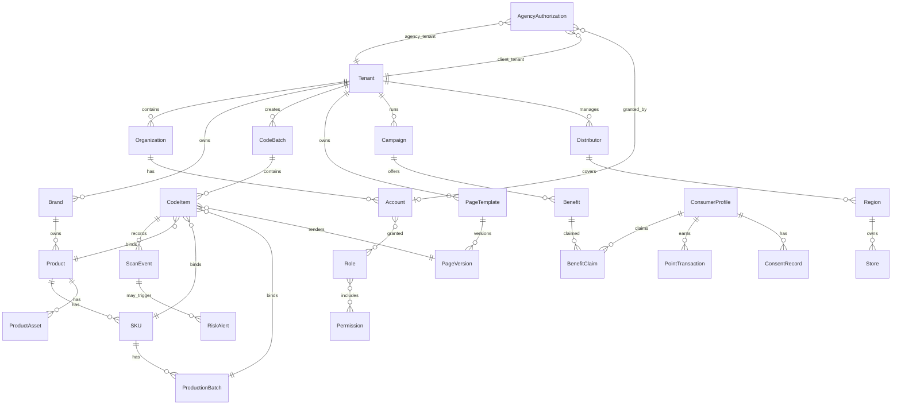
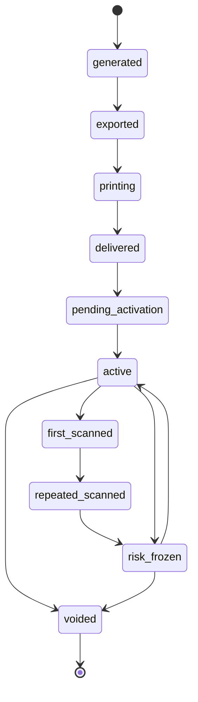
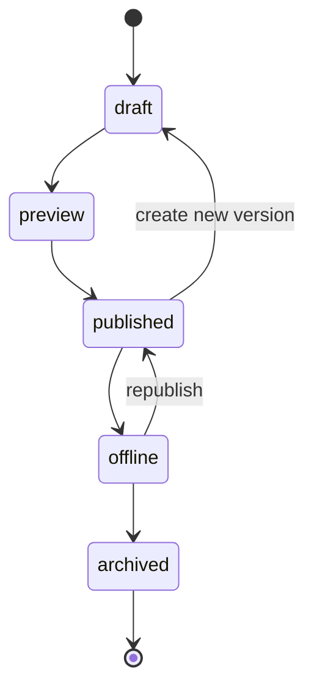

# 数据模型

> 本文档基于 `backend/app/models/` 代码审计（2026-06-03），总计 69 个模型、28 个文件。

## 1. 核心实体关系

## 2. 核心表

### tenants (tenant.py)

| 字段 | 类型 | 说明 |
|---|---|---|
| id | uuid | 租户 ID |
| name | string | 租户名称 |
| slug | string | URL 标识 |
| tenant_type | enum | brand, regional_org, agency, platform |
| status | enum | trial, active, suspended, expired |
| industry | string | 行业 |
| plan | string | 套餐标识 |
| plan_expires_at | datetime | 套餐过期时间 |
| quota | jsonb | 额度配置 |
| compliance_settings | jsonb | 合规设置 |
| onboarding_progress | jsonb | 开通进度 |
| enabled_features | jsonb | 启用的功能 |
| custom_domain | string | 客户自有域名 |

### organizations (tenant.py)

| 字段 | 类型 | 说明 |
|---|---|---|
| id | uuid | 组织 ID |
| tenant_id | uuid | 租户 |
| parent_id | uuid | 上级组织 |
| org_type | enum | platform, agency, regional_org, brand, distributor, store, print_partner |
| name | string | 组织名称 |
| status | enum | active, disabled |

### accounts (tenant.py)

| 字段 | 类型 | 说明 |
|---|---|---|
| id | uuid | 账户 ID |
| tenant_id | uuid | 租户 |
| organization_id | uuid | 组织 |
| email | string | 邮箱 |
| hashed_password | string | 密码哈希 |
| name | string | 姓名 |
| failed_login_attempts | int | 失败登录次数 |
| locked_until | datetime | 锁定截止 |
| last_login_at | datetime | 最后登录 |

### roles / permissions (tenant.py)

| 字段 | 类型 | 说明 |
|---|---|---|
| id | uuid | ID |
| tenant_id | uuid | 租户 |
| name | string | 名称 |
| code | string | 权限编码（permissions 表） |
| description | string | 说明 |

### plan_definitions (plan.py)

| 字段 | 类型 | 说明 |
|---|---|---|
| id | uuid | 套餐 ID |
| name | string | 套餐标识 |
| display_name | string | 显示名 |
| price_yearly | decimal | 年价 |
| quota_defaults | jsonb | 默认额度 |
| feature_flags | jsonb | 功能开关 |
| is_active | boolean | 是否启用 |
| sort_order | int | 排序 |

## 3. 产品资料库（product.py）

### brands

| 字段 | 类型 | 说明 |
|---|---|---|
| id | uuid | 品牌 ID |
| tenant_id | uuid | 租户 |
| name | string | 品牌名称 |
| logo_url | string | Logo |
| description | text | 描述 |
| status | enum | draft, active, archived |
| external_id | string | 外部 ID |
| source_system | string | 来源系统 |

### products

| 字段 | 类型 | 说明 |
|---|---|---|
| id | uuid | 产品 ID |
| tenant_id | uuid | 租户 |
| brand_id | uuid | 品牌 |
| name | string | 产品名称 |
| category | string | 品类 |
| origin | string | 产地 |
| image_url | string | 图片 |
| story_title | string | 故事标题 |
| story_content | text | 故事内容 |
| description | text | 产品介绍 |
| status | enum | draft, active, archived |
| external_id | string | 外部 ID |
| source_system | string | 来源系统 |

### skus

| 字段 | 类型 | 说明 |
|---|---|---|
| id | uuid | SKU ID |
| tenant_id | uuid | 租户 |
| product_id | uuid | 产品 |
| code | string | SKU 编码 |
| name | string | 名称 |
| specifications | jsonb | 规格 |
| package_type | string | 包装类型 |
| barcode | string | 条形码/GTIN |
| image_url | string | 图片 |
| status | enum | draft, active, archived |

### production_batches

| 字段 | 类型 | 说明 |
|---|---|---|
| id | uuid | 批次 ID |
| tenant_id | uuid | 租户 |
| product_id | uuid | 产品 |
| sku_id | uuid | SKU |
| batch_code | string | 批次号 |
| production_date | date | 生产日期 |
| expiry_date | date | 保质期截止 |
| origin | string | 产地 |
| status | enum | draft, active, archived |

### product_assets

| 字段 | 类型 | 说明 |
|---|---|---|
| id | uuid | 资料 ID |
| tenant_id | uuid | 租户 |
| product_id | uuid | 产品 |
| asset_type | enum | 检测报告、资质证书、素材等 |
| name | string | 名称 |
| file_url | string | 文件 URL |
| image_url | string | 图片 URL |
| issuer | string | 发证方 |
| valid_until | date | 有效期 |
| status | enum | draft, active, archived |

## 4. 码管理（code.py）

### code_batches

| 字段 | 类型 | 说明 |
|---|---|---|
| id | uuid | 码批次 ID |
| tenant_id | uuid | 租户 |
| code_type | enum | batch_code, item_code, outer_inner_pair, box_code |
| generation_mode | enum | 生成方式 |
| quantity | int | 数量 |
| batch_code | string | 批次编码 |
| product_id | uuid | 产品 |
| sku_id | uuid | SKU |
| production_batch_id | uuid | 生产批次 |
| distributor_id | uuid | 经销商 |
| region_id | uuid | 预期区域 |
| status | enum | generated, exported, printing, delivered, pending_activation, active, frozen, voided |
| created_by | uuid | 创建人 |

### code_items

| 字段 | 类型 | 说明 |
|---|---|---|
| id | uuid | 内部 ID |
| tenant_id | uuid | 租户 |
| code_batch_id | uuid | 码批次 |
| public_id | string | 对外短码 ID，不可枚举 |
| code_type | enum | single, outer, inner, box |
| pair_id | uuid | 内外码配对 |
| status | enum | generated, exported, active, first_scanned, repeated_scanned, risk_frozen, voided |
| activated_at | datetime | 激活时间 |
| bound_at | datetime | 绑定时间 |
| revoked_at | datetime | 撤销时间 |

## 5. 页面引擎（page.py）

### page_templates

| 字段 | 类型 | 说明 |
|---|---|---|
| id | uuid | 模板 ID |
| tenant_id | uuid | 租户 |
| product_id | uuid | 产品 |
| name | string | 模板名称 |
| template_type | string | 模板类型 |
| status | enum | draft, active, archived |
| description | text | 描述 |

### page_versions

| 字段 | 类型 | 说明 |
|---|---|---|
| id | uuid | 页面版本 ID |
| tenant_id | uuid | 租户 |
| page_template_id | uuid | 模板 |
| version | int | 版本号 |
| status | enum | draft, preview, published, offline, archived |
| config_json | jsonb | 页面配置 DSL |
| published_at | datetime | 发布时间 |
| created_by | uuid | 创建人 |

## 6. 活动与权益（campaign.py）

### campaigns

| 字段 | 类型 | 说明 |
|---|---|---|
| id | uuid | 活动 ID |
| tenant_id | uuid | 租户 |
| name | string | 活动名称 |
| campaign_type | enum | coupon, points, lottery, lead, private_domain, mixed |
| product_id | uuid | 关联产品 |
| start_at | datetime | 开始时间 |
| end_at | datetime | 结束时间 |
| status | enum | draft, active, paused, ended |
| rules_json | jsonb | 活动规则 |
| description | text | 描述 |

### benefits

| 字段 | 类型 | 说明 |
|---|---|---|
| id | uuid | 权益 ID |
| tenant_id | uuid | 租户 |
| campaign_id | uuid | 活动 |
| name | string | 权益名称 |
| benefit_type | enum | platform_coupon, external_link, code_pool, api_coupon, gift, points, private_domain, offline_verify |
| config_json | jsonb | 权益配置 |
| connector_id | uuid | 外部连接器 |
| stock_total | int | 总库存 |
| stock_used | int | 已发放 |
| per_person_limit | int | 每人限领 |
| status | enum | active, disabled |

### benefit_claims

| 字段 | 类型 | 说明 |
|---|---|---|
| id | uuid | 领取记录 ID |
| tenant_id | uuid | 租户 |
| benefit_id | uuid | 权益 |
| campaign_id | uuid | 活动 |
| consumer_id | uuid | 消费者 |
| idempotency_key | string | 幂等键 |
| claim_type | string | 领取类型 |
| status | enum | claimed, delivered, failed, cancelled |
| delivery_status | enum | pending, delivered, failed |

## 7. 消费者与会员（member.py + consent.py）

### consumer_profiles (member.py)

| 字段 | 类型 | 说明 |
|---|---|---|
| id | uuid | 消费者 ID |
| tenant_id | uuid | 租户 |
| wechat_openid | string | 微信 openid |
| phone_hash | string | 手机号哈希 |
| phone_encrypted | string | AES-GCM 加密手机号 |
| nickname | string | 昵称 |
| member_level | string | 会员等级 |
| tags | jsonb | 用户标签 |
| total_points | int | 累计积分 |
| extra_data | jsonb | 扩展数据 |

### point_transactions (member.py)

| 字段 | 类型 | 说明 |
|---|---|---|
| id | uuid | 流水 ID |
| tenant_id | uuid | 租户 |
| consumer_id | uuid | 消费者 |
| amount | int | 变动金额 |
| balance_after | int | 变动后余额 |
| txn_type | enum | earn, spend, expire, adjust |
| reason | string | 原因 |
| reference_id | uuid | 关联 ID |
| expires_at | datetime | 积分过期时间 |

### point_rules (member.py)

| 字段 | 类型 | 说明 |
|---|---|---|
| id | uuid | 规则 ID |
| tenant_id | uuid | 租户 |
| rule_type | string | 规则类型 |
| points | int | 积分值 |
| enabled | boolean | 是否启用 |
| daily_limit | int | 每日上限 |
| config | jsonb | 规则配置 |

### point_products / point_redemptions (member.py)

积分商品和兑换记录。

### consent_records (consent.py)

| 字段 | 类型 | 说明 |
|---|---|---|
| id | uuid | 授权记录 ID |
| tenant_id | uuid | 租户 |
| consumer_id | uuid | 消费者 |
| consent_type | enum | privacy_policy, mobile, wechat, form, subscription_message, marketing_opt_in |
| status | enum | granted, withdrawn |
| public_id | string | 公开 ID |
| ip_hash | string | IP 哈希 |
| granted_at | datetime | 授权时间 |
| withdrawn_at | datetime | 撤回时间 |
| evidence_json | jsonb | 授权证据 |

## 8. 扫码事件（scan.py）

### scan_events

| 字段 | 类型 | 说明 |
|---|---|---|
| id | uuid | 事件 ID |
| tenant_id | uuid | 租户 |
| public_id | string | 码 ID |
| scan_time | datetime | 扫码时间 |
| ip_hash | string | IP 哈希 |
| user_agent | string | UA |
| is_first_scan | boolean | 是否首扫 |
| environment | jsonb | 扫码环境 |

## 9. 渠道与区域（channel.py）

### distributors

| 字段 | 类型 | 说明 |
|---|---|---|
| id | uuid | 经销商 ID |
| tenant_id | uuid | 租户 |
| name | string | 名称 |
| code | string | 编码 |
| contact_name | string | 联系人 |
| contact_phone_encrypted | string | AES-GCM 加密电话 |
| contact_phone_hash | string | 电话哈希 |
| status | enum | active, disabled |

### regions

| 字段 | 类型 | 说明 |
|---|---|---|
| id | uuid | 区域 ID |
| tenant_id | uuid | 租户 |
| name | string | 名称 |
| code | string | 编码 |
| province | string | 省 |
| city | string | 市 |
| coverage_type | enum | 覆盖类型 |
| coverage_areas | jsonb | 覆盖区域 |
| distributor_id | uuid | 经销商 |
| status | enum | active, disabled |

### stores

| 字段 | 类型 | 说明 |
|---|---|---|
| id | uuid | 门店 ID |
| tenant_id | uuid | 租户 |
| name | string | 名称 |
| code | string | 编码 |
| region_id | uuid | 区域 |
| distributor_id | uuid | 经销商 |
| address | string | 地址 |
| status | enum | active, disabled |

### code_allocations

| 字段 | 类型 | 说明 |
|---|---|---|
| id | uuid | 分配 ID |
| tenant_id | uuid | 租户 |
| batch_id | uuid | 码批次 |
| store_id | uuid | 门店 |
| region_id | uuid | 区域 |
| distributor_id | uuid | 经销商 |
| quantity | int | 数量 |
| allocated_at | datetime | 分配时间 |

### diversion_clues

窜货线索记录，包含 expected_region、detected_city、resolution 信息。

### account_channel_scopes

账号渠道范围，控制操作员可见的经销商/区域/门店。

## 10. 区域品牌/协会（regional.py）

### regional_orgs

| 字段 | 类型 | 说明 |
|---|---|---|
| id | uuid | 组织 ID |
| tenant_id | uuid | 租户 |
| name | string | 名称 |
| org_type | string | 组织类型 |
| config | jsonb | 配置 |

### regional_org_members / regional_templates / regional_product_auths / regional_code_rules

区域组织下的成员、模板、产品授权、码规则。

### whitelabel_configs

白标配置：brand_name、hide_yimatong、primary_color、logo_url、favicon_url、font_family、custom_css。

### tenant_domains

租户自定义域名：domain、ssl_status、verified、cname_target。

## 11. 风控（risk.py）

### risk_alerts

| 字段 | 类型 | 说明 |
|---|---|---|
| id | uuid | 告警 ID |
| tenant_id | uuid | 租户 |
| alert_type | string | 告警类型 |
| public_id | string | 码 ID |
| code_item_id | uuid | 码项 |
| detail | jsonb | 详情 |
| ip_hash | string | IP 哈希 |
| resolved | boolean | 是否已处理 |

### risk_rules

风控规则：rule_type、action、config、enabled。

### campaign_risk_rules

活动关联的风控规则。

### interception_records

拦截记录：action、context、auto_triggered、action_taken。

### risk_notifications

风控通知：notification_type、title、detail、read。

## 12. 外部连接器（connector.py）

### connectors

| 字段 | 类型 | 说明 |
|---|---|---|
| id | uuid | 连接器 ID |
| tenant_id | uuid | 租户 |
| name | string | 名称 |
| connector_type | string | 类型 |
| config | jsonb | 配置 |
| secrets_encrypted | string | 加密密钥 |
| enabled | boolean | 是否启用 |

### coupon_pools / coupon_codes

券码池和券码管理。

### benefit_deliveries

权益投递记录：status、retry_count、max_retries、next_retry_at。

## 13. 代理授权（tenant.py）

### agency_authorizations

| 字段 | 类型 | 说明 |
|---|---|---|
| id | uuid | 授权 ID |
| agency_tenant_id | uuid | 代运营租户 |
| client_tenant_id | uuid | 品牌客户租户 |
| scope | json | 授权范围 |
| status | enum | active, revoked, expired |
| granted_by | uuid | 授权人 |
| granted_at | datetime | 授权时间 |
| revoked_at | datetime | 撤回时间 |
| expires_at | datetime | 过期时间 |

**约束**：每个 (agency_tenant_id, client_tenant_id) 组合只允许一条 status='active' 的记录。

## 14. Webhook（webhook.py）

### webhook_endpoints

| 字段 | 类型 | 说明 |
|---|---|---|
| id | uuid | 端点 ID |
| tenant_id | uuid | 租户 |
| url | string | 回调 URL |
| events | jsonb | 订阅事件类型 |
| secret | string | 签名密钥 |
| enabled | boolean | 是否启用 |
| batch_mode | boolean | 批量模式 |
| batch_size | int | 批量大小 |

### api_keys

API Key 管理：name、key、role、permissions、revoked、expires_at。

### webhook_deliveries

投递记录：event_type、payload、status、retry_count、next_retry_at、last_response_code。

## 15. GMV 归因（gmv.py）

### external_orders

外部订单：external_id、amount、phone_hash、product_name、matched、channel、source_system。

### gmv_attributions

归因记录：public_id、code_item_id、campaign_id、consumer_id、amount、match_type、scan_time、attribution_window_hours、confidence_score。

### gmv_daily_stats

日统计：stat_date、campaign_id、channel、attributed_gmv、attributed_orders、scan_count、scan_uv。

## 16. 其他模型

### analytics.py
- **daily_scan_stats** — 日扫码统计：date、total_scans、uv、first_scans、rescans

### tenant_health.py
- **tenant_health_metrics** — 租户健康指标：last_scan_at、scans_last_7d/30d、active_campaigns、days_until_expiry、health_score

### export_log.py
- **export_log** — 导出记录：export_type、resource_id、file_name、row_count、status

### audit.py
- **platform_audit_logs** — 平台审计日志：operator_id、target_tenant_id、action、resource

### sync_mapping.py
- **sync_mappings** — 同步映射：local_entity_type、local_entity_id、source_system、external_id、sync_direction

### private_domain.py
- **private_domain_configs** — 私域配置：config_type、name、config

### i18n.py
- **translations** — 翻译：key、locale、value

### ai_generation.py
- **ai_generations** — AI 生成记录：type、target_type、target_id、input_snapshot、output_data、model_version

### wecom.py
- **wecom_contact_ways** — 企微联系方式：connector_id、campaign_id、config_id、qr_code、user_ids
- **wecom_external_contacts** — 企微外部联系人：external_userid、consumer_id、unionid、added_at

### integration.py
- **sync_records** — 同步记录：sync_type、external_id、data

### tenant.py（ops_tasks）
- **ops_tasks** — 代运营任务：assigned_to、title、status、priority、due_date

## 17. 状态机

### 17.1 码状态机

### 17.2 页面版本状态机

## 18. 数据设计原则

1. 所有业务表包含 tenant_id。
2. 码、页面、活动、权益必须支持版本化或历史记录。
3. 消费者个人信息尽量存最小必要字段，手机号使用 AES-256-GCM 加密 + HMAC-SHA256 哈希索引。
4. 事件表不可频繁更新，采用追加写入。
5. 权益领取必须有幂等键（idempotency_key），避免重复发放。
6. 外部系统数据保留 external_id 和 source_system。
7. 所有导出行为记录 export_log。
8. 主键使用 UUID v7（时间排序），使用 uuid6 库。
