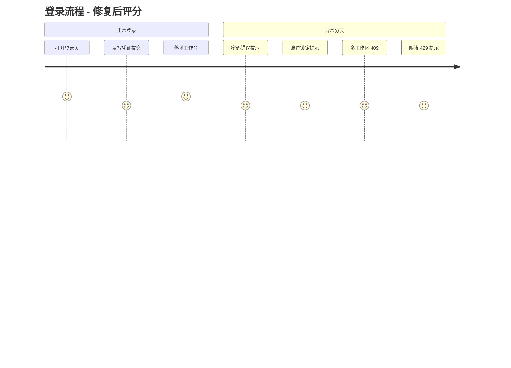
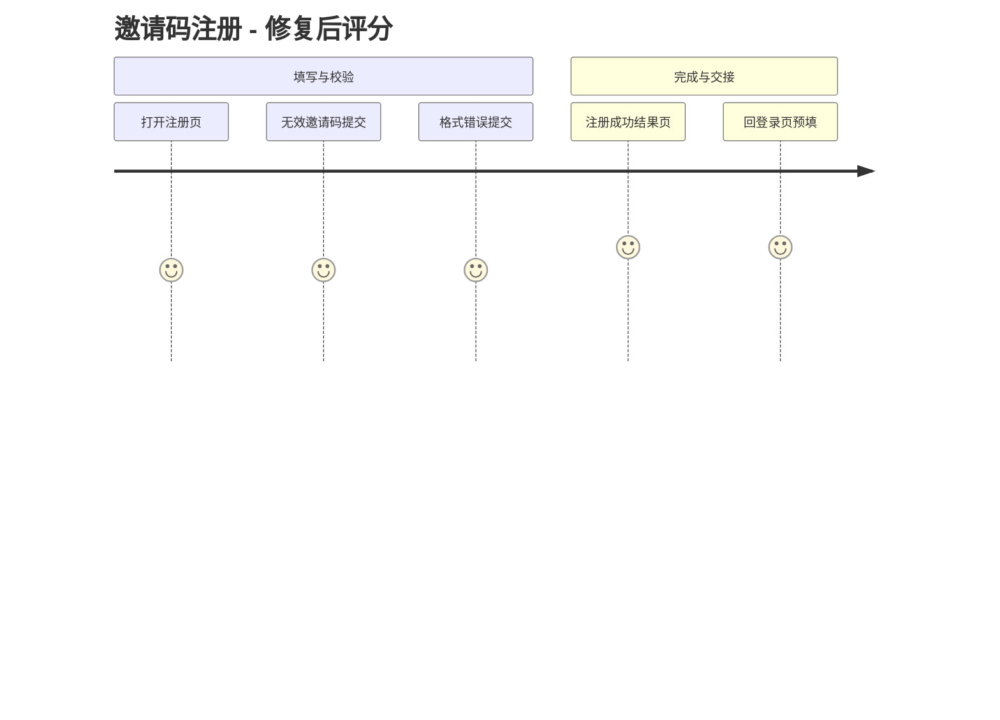
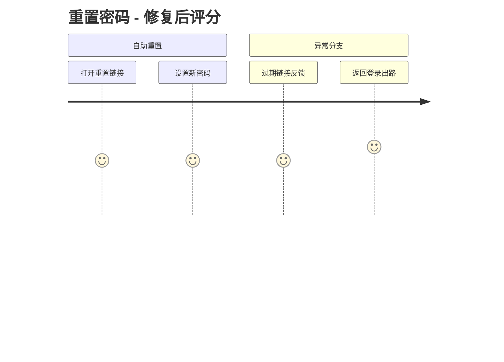
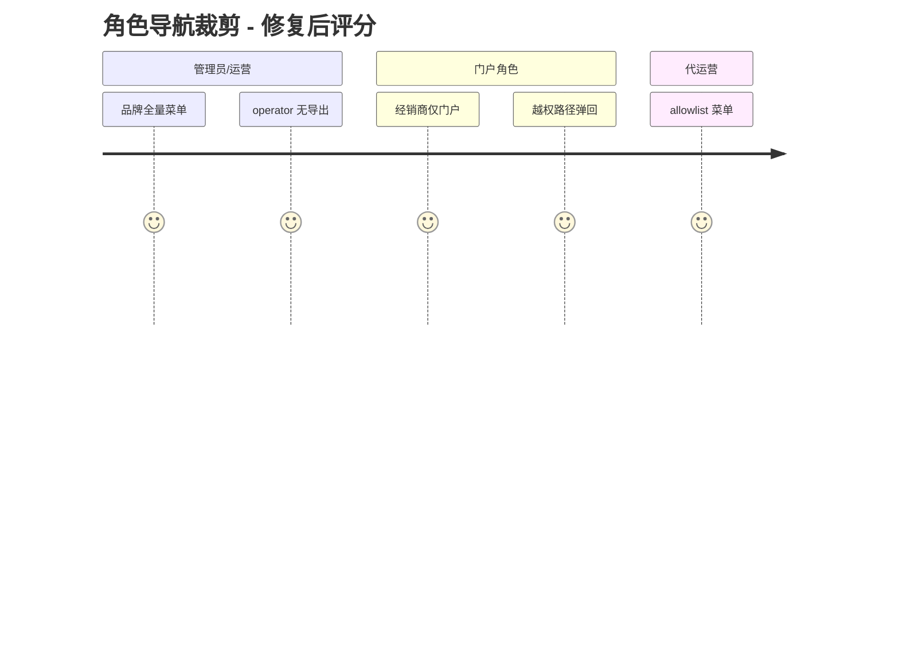

# User Journey Review Report - M1 认证与导航壳

### 📊 Review Overview

- Review Date: 2026-09-05
- Scope: 登录 / 邀请码注册 / 令牌重置密码 / 首次登录改密 / 菜单权限裁剪（brand·operator·distributor·store_guide·agency 五视角）
- 方式: 代码驱动旅程映射 + 真实浏览器走查（seed demo 数据，admin 3003 / backend 8001）
- Issues Found: 4 Critical/Moderate 全部修复 / 6 Suggestions 5 修复 1 记录 / 新增发现 2 项已修复
- Journey Score（修复后均值）: 4.4

---

### 🗺️ User Journey Diagrams

#### 1. 登录流程

#### 2. 邀请码注册

#### 3. 重置密码

#### 4. 角色与导航裁剪

---

### 🟡 Moderate Issues（全部已修复）

#### 1. 账户锁定后正确密码仍提示「邮箱或密码不正确」，用户无出路

- **Location**: `backend/app/services/auth.py:282`（原 401 统一文案）、`frontend/apps/admin/src/app/(auth)/login/page.tsx:157`（死分支 `includes("locked")`）
- **Analysis**: 密码验证通过后才检查锁定，此时返回可区分提示不构成枚举泄露；但原实现复用防枚举文案，用户拿着正确密码 15 分钟内反复被拒且不知原因。前端判定英文 "locked" 的分支永不命中。
- **Fix**: 后端密码验证通过后的锁定分支改返回 423 + 中文提示（含剩余分钟数与出路）；前端锁定分支改为匹配「锁定」并直接展示服务端 detail。
- **Verification**: `test_account_locked_after_5_failures` 更新为断言 423 + 「锁定」；浏览器实测连错 5 次后正确密码返回锁定提示。

#### 2. 重置链接失效时仅 toast，页面停留在永不成功的表单

- **Location**: `frontend/apps/admin/src/app/(auth)/reset-password/page.tsx:57-63`
- **Analysis**: 最常见失败（1 小时链接过期）没有持久 UI，toast 消失后用户面对可无限重试但永不成功的表单。
- **Fix**: catch 中对 4xx 确定性失败切换到 error Result 态（「无法重置密码 + 联系管理员重新生成 + 返回登录」）；网络/5xx 保持 toast 可重试。
- **Verification**: 浏览器实测伪造 token 提交后展示持久错误结果页，含「返回登录」出路。

#### 3. change-password 无限流、无审计

- **Location**: `backend/app/api/v1/password.py:40-60`
- **Analysis**: 旧密码试错可无限暴力尝试；密码变更不留 audit 轨迹，与 generate/confirm-reset 等其它认证边界不一致。
- **Fix**: 增加共享缓存限流（10 次/分/账号，429）+ `write_audit_log(action="password_changed")`。
- **Verification**: 新增 `test_change_password_rate_limited`、改密审计断言；`tests/test_api/test_password.py` 8 用例全绿。

#### 4. 静默刷新遇网络抖动把仍有有效会话的用户硬登出

- **Location**: `frontend/apps/admin/src/lib/auth.ts:305-310`（catch-all clearSession）、`frontend/apps/admin/src/lib/api.ts`（null → logout）
- **Analysis**: refresh 请求网络失败/5xx 时与「刷新被拒」同样清除会话，弱网环境误伤；且 clearSession 清不掉 HttpOnly refresh cookie，残留服务端有效会话。
- **Fix**: 区分「服务端明确拒绝（400/401/403）→ 清会话登出」与「暂时性失败 → 抛 RefreshUnavailableError 保留会话」，拦截器 catch 路径不登出、仅拒绝本次请求。
- **Verification**: `pnpm exec vitest run src/lib` 80 用例全绿；类型检查通过。

---

### 🔵 Suggestions（5 项已修复，1 项记录）

#### 5. 演示快捷账号（含平台超管密码）硬编码进前端 bundle【已修复】

- **Location**: `frontend/apps/admin/src/app/(auth)/login/page.tsx:228-274`
- **Fix**: 整个演示面板用 `process.env.NODE_ENV !== "production"` 门控，生产构建不再包含演示密码。

#### 6. 登录本地节流错误被伪装成「凭证错误」【已修复】

- **Location**: `login/page.tsx` onFinish catch
- **Fix**: 无 `response` 的本地错误（2 秒节流、网络中断）直接展示其本意文案，不再落兜底「请检查邮箱和密码」。

#### 7. middleware 公开路径 startsWith 前缀误匹配【已修复】

- **Location**: `frontend/apps/admin/src/middleware.ts:55`
- **Fix**: 改为与 `matchesRoute` 一致的精确/子路径匹配，`/loginX` 不再被视为公开路径。

#### 8. 菜单 blocklist 组键判定为潜伏死代码【已修复】

- **Location**: `frontend/apps/admin/src/app/(dashboard)/layout.tsx:579-582`
- **Fix**: blocklist 模式下组键被显式封禁时整组移除（原逻辑静默失效）；allowlist 语义不变。

#### 9. pydantic 英文校验错误原文直出 UI【已修复，走查新发现】

- **Location**: `frontend/apps/admin/src/lib/api.ts` `extractErrorMessage`
- **Analysis**: 注册页邮箱含 `.local` 域时，UI 直接显示 "value is not a valid email address: The part after the @-sign is a special-use..."。
- **Fix**: 数组 detail 无中文时返回通用指引「提交的信息格式有误，请检查各填写项后重试」，全站生效。
- **Verification**: 浏览器复验注册页展示友好中文。

#### 10. access_token 存 localStorage 的 XSS 窗口【记录，不改动】

- **Location**: `frontend/apps/admin/src/lib/auth.ts`
- **Decision**: 属已知架构折中（refresh HttpOnly + 服务端会话族撤销兜底）。改造为内存 token + 静默刷新影响面大，列入「待决策」由产品/安全评估。

---

### ✅ 走查验证记录（seed demo @ 2026-09-05）

| 场景                                                                                       | 结果                     |
| ------------------------------------------------------------------------------------------ | ------------------------ |
| admin 登录 → 全量 brand 菜单（无 agency/portal）                                           | ✓                        |
| operator 菜单无「导出管理」                                                                | ✓                        |
| /regional、/accounts 对 operator 可见且页面可开（middleware BRAND_ONLY + 后端 RBAC 一致）  | ✓（M6 再核 viewer 角色） |
| distributor 登录 → 仅「工作台+经销商入口」，/codes、/settings/roles 均弹回 /channel-portal | ✓                        |
| store_guide → /store-portal 同上                                                           | ✓                        |
| 连错 5 次锁定 + 正确密码提示（修复前误导/修复后可区分）                                    | ✓                        |
| 无效邀请码 → 「邀请码无效、已过期或已用完 + 指引」                                         | ✓                        |
| 伪造重置 token → toast（修复前）/ 错误结果页（修复后）                                     | ✓                        |
| agency（demo-agency）→ allowlist 菜单（无商品资料/渠道组织/风控中心/集成管理/导出）        | ✓                        |
| 多工作区同邮箱按 slug 区分（agency@demo.com 同时存在于 demo 与 demo-agency 的行为确认）    | ✓                        |

### 📋 待决策

1. **Issue 10**（token 存储架构）是否立项改造。
2. 登录页「代运营顾问」演示按钮预填 slug=demo，实际登录的是 demo 品牌租户内的同名 operator 账号（seed.py DEMO_ACCOUNTS），而非 demo-agency 组织管理员（agency_admin@demo.com / demopass）。演示语义易混淆，是否调整 seed 或按钮预填值。
