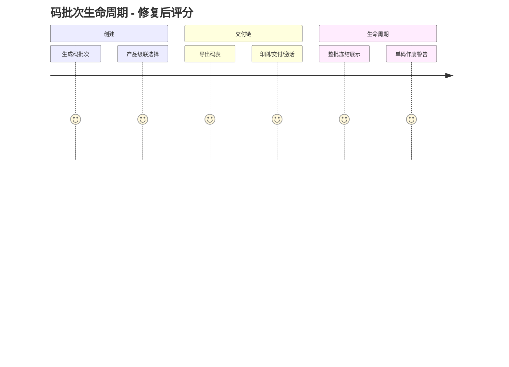
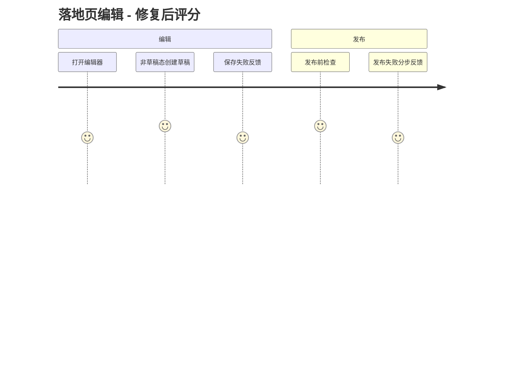

# User Journey Review Report - M3 一物一码与落地页

### 📊 Review Overview

- Review Date: 2026-09-05
- Scope: 码批次创建 → 交付链（导出/印刷/交付/激活）→ 单码与整批生命周期 → 既有码接管；页面模板 DSL 编辑 → 保存 → 发布 → 预览
- 方式: 代码驱动深度审查 + 真实浏览器走查（列表/详情冒烟）+ 基线测试修复
- Issues Found: 3 高 + 4 中高 + 3 中低（P1-P10）+ 1 产品级审计缺陷（P8）；本次修复 P1-P6、P8、P9，P7/P10 记录
- Journey Score（修复后均值）: 4.1

---

### 🗺️ User Journey Diagrams

#### 1. 码批次主链路

#### 2. 落地页编辑发布

---

### 🟠 高优先级（全部已修复）

#### P1 作废单个码后整批永久无法导出（状态机死路）

- **Location**: `backend/app/services/code_export.py:34`（可交付状态集不含 revoked）+ `codes/[id]/page.tsx` 单码作废入口
- **现状**: completed 批次作废任一码 → 导出永远 409 `CODE_BATCH_ITEM_NOT_DELIVERABLE`，无补救路径。
- **Fix（缓解）**: 单码作废弹窗在批次未导出时新增醒目警告「作废后该批次将无法导出码表」；配合 P5 修复，409 语义可透出。
- **待决策**: 是否支持「导出排除已作废码」契约（需调整 expected_item_count 合约与 manifest 结构）。

#### P2 整批冻结/作废后批次状态与操作不真实

- **Location**: `services/code.py:1168-1328`（只改 item）+ `codes/[id]/page.tsx:370-548`（仅按 batch.status 渲染）
- **Fix**: 详情页从已加载 items 派生终态展示（全部 revoked → 「已作废」；全部 frozen+revoked → 「已冻结」），并隐藏「导出码表」与整批冻结/作废按钮；单码恢复等操作保留。
- **Verification**: 新增 vitest 用例覆盖派生展示与按钮隐藏；浏览器冒烟正常批次不受影响。

#### P3 DSL 编辑器加载已发布版本时的死路

- **Location**: `pages/[id]/edit/page.tsx:60-61`（draft 缺失时静默加载 published）+ `EditorHeader.tsx:72-81`
- **Fix**: 非草稿态显示持久横幅「当前查看的是已发布版本（只读）」+「基于当前版本创建草稿」按钮（POST versions 后刷新进入草稿态）。

### 🟡 中高优先级（全部已修复）

- **P4 生成批次按钮死路**: 产品加载失败不再禁用「生成码批次」按钮，Modal 内已有错误 Alert + 重试（`codes/page.tsx:825`）。
- **P5 错误提示吞 detail**: codes 列表页 6 处、详情页 9 处固定文案全部换用 `extractErrorMessage(error, 原文案)`，服务端 409/429 精确语义可达用户。
- **P6 接管导入失败无修复路径**: dry_run 失败行 >0 时展示「下载错误明细」（POST errors.csv → blob 下载）+「重试失败行」（retry-failed）；imports 状态列中文化（预检完成/导入完成/导入失败）。
- **P9 发布「先存后发」反馈失真**: patch 成功 + publish 失败改为「草稿已保存，但发布失败：<detail>」，保存失败同样透出 detail。

### 🟠 产品级缺陷（已修复）

#### P8 导出重复写审计（test_code_export 契约失败根因）

- **Location**: `app/api/v1/code_batches.py` export 端点 + `services/code_export.py`
- **根因**: service 层首次导出已写 `code_csv` 审计（PG 授权链/SQLite legacy），端点又按用户幂等键写 `code_csv_download`；换键重试时端点行无法按 key 去重 → 3 行。
- **Fix**: 端点先查同批次同 checksum 的既有审计（code_csv / code_csv_download），命中即复用为 replayed 记录，不再新增。
- **Verification**: `test_code_export.py` 13/13 全绿。

### 🔧 测试基线修复（夹具过期 + 断言演进）

- `test_dual_code.py`、`test_integration/`、`test_code_list.py`：POST /code-batches 夹具补必填 `Idempotency-Key`；同步生成批次的直接 activate 改为完整 交付链 生命周期（契约演进）。
- 断言按现行契约更新并注明原因：内码 HTML 解析（launch 门禁下降级页，验真交互在 H5 JSON 路径）、重复领取幂等重放（201 + 同 claim_id，非 409）、未激活批次码 fail-closed 404。
- takeover 页 3 个 vitest 基线失败经实测已自愈（近期提交已修复），无需动作。

### 📋 待决策

1. **P7 非微信 UA 扫码渲染降级**: 系统相机扫码（HTML 路径）的 Jinja 模板不理解 modules DSL，显示近乎空白的降级页；编辑器预览/微信 UA/H5 JSON 三端正常。建议评估：HTML fallback 改走 H5 渲染 或 Jinja 支持 modules。
2. **P1 契约**: 是否支持导出排除已作废码。
3. **P10 低优**: paired 批次激活百分比可能 >100%；pages 详情 viewer 角色可见发布按钮（后端 403 兜底）；「预览线上页」依赖 cookie 会话直连后端。

### ✅ 验证记录（2026-09-05）

| 项                                                         | 结果                        |
| ---------------------------------------------------------- | --------------------------- |
| 码模块 API 测试（code_batch/item/export/takeover/page_*）  | 144 通过                    |
| dual_code + integration + code_list                        | 46 通过（含夹具与断言修复） |
| admin vitest codes 目录（含新增 5 用例）                   | 33/33                       |
| tsc --noEmit / eslint 改动文件                             | 通过                        |
| 浏览器冒烟：登录 → codes 列表 → 批次详情（已激活正常展示） | ✓                           |
