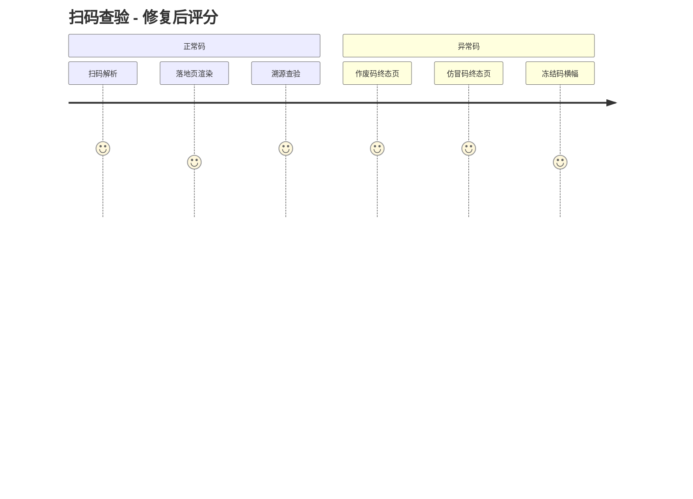
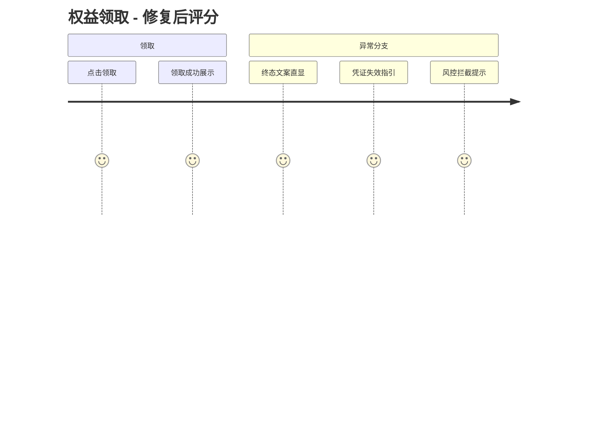
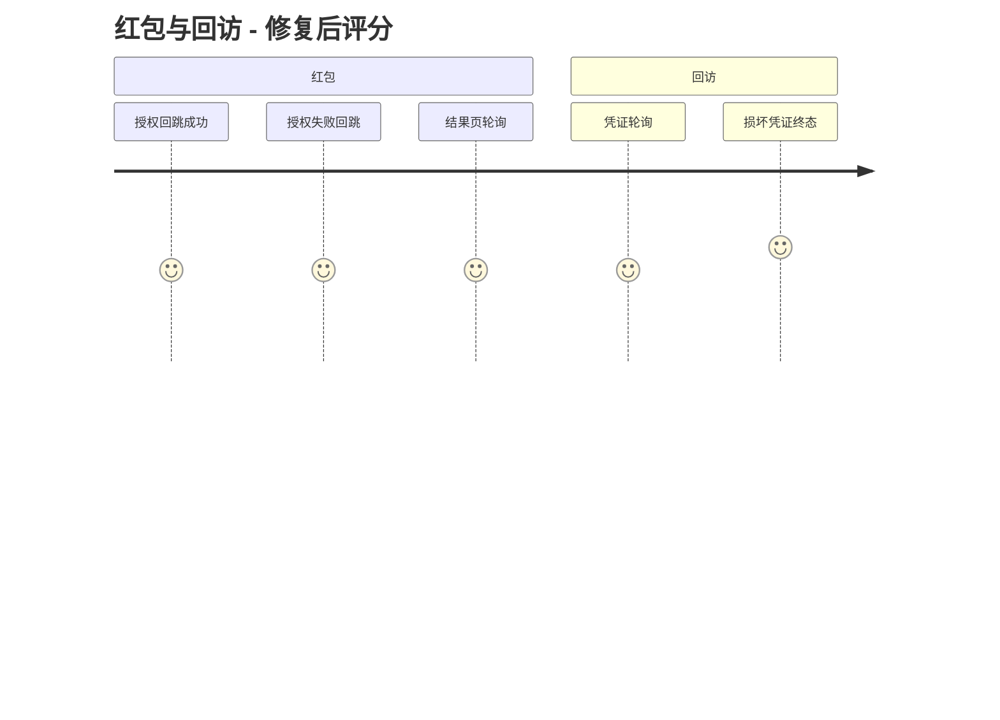

# User Journey Review Report - M2 消费者扫码主旅程（H5）

### 📊 Review Overview

- Review Date: 2026-09-05
- Scope: 码解析（resolver 全状态分支）→ 落地页渲染 → 埋点 → 入会授权 → 领券/红包 → 结果页轮询 → 回访
- 方式: 代码驱动深度审查 + 真实浏览器走查（revoked/activated/not_found/领取链路实测）
- Issues Found: 2 Critical + 10 Moderate + 6 Suggestion；本次修复 2C + 8M + 1S，其余记录
- Journey Score（修复后均值）: 4.3

---

### 🗺️ User Journey Diagrams

#### 1. 扫码查验主流程

#### 2. 权益领取流程

#### 3. 红包与回访

---

### 🔴 Critical Issues（全部已修复）

#### 1. 作废码/仿冒码展示为「网络异常」，防伪价值主张受损

- **Location**: `frontend/apps/h5/src/app/c/[publicId]/CodePageClient.tsx:48`（原 `if (!response.ok) throw`）
- **Analysis**: 后端 resolver 为终态设计了 410 voided / 404 not_found / 503 unavailable 的 JSON 契约，前端也有对应渲染分支，但 fetch 对一切非 2xx 直接抛错——只有 unactivated（HTTP 200）可达，作废码/假码用户看到「网络异常请重试」+ 自动重试，确定性终态被引导无限重试。
- **Fix**: CodePageClient 对非 2xx 也解析 body，带 `code_data.result` 契约时分发给落地页且不自动重试；ResolveContent 补 `not_found` → ErrorPage 分支。
- **Verification**: 浏览器实测 revoked 码显示「码已作废」终态页、假码显示「查无此码」；`CodePageClient.test.tsx` 全绿。

#### 2. 微信 OAuth 回调失败在微信 webview 内裸吐 JSON，用户拒绝授权即死路

- **Location**: `backend/app/api/v1/wechat_oauth.py` oauth-callback（原各失败路径 raise HTTPException）
- **Analysis**: 成功路径 303 回跳 H5，全部失败路径（state 过期 300s、用户拒绝授权、并发处理、consent 失效、微信换 token 失败）直接返回 JSON detail——用户只能杀页面重扫。拒绝授权/链接过期是常态路径。
- **Fix**: 可定位码页的失败 303 回跳 `/c/{public_id}#oauth=failed&reason=...`（reason 细分 scan_token_expired / consent_required / not_granted / exchange_failed / rate_limited）；无法定位码页的（state 过期/无效、IP 限流、Redis 不可用）渲染内联中文提示页。CodePageClient 消费失败 fragment 并清理 URL，ResolveContent 顶部展示对应中文提示条。
- **Verification**: `test_wechat_oauth.py` 9 用例全绿（2 个用例按新契约更新：consent 失效断言 303 + fragment，state 失效断言内联 HTML）。

---

### 🟡 Moderate Issues（8 项已修复）

| #   | 问题                                                                            | 位置                                                | 修复                                                                                                                                |
| --- | ------------------------------------------------------------------------------- | --------------------------------------------------- | ----------------------------------------------------------------------------------------------------------------------------------- |
| M1  | scan_token 绑 IP + 30min TTL，网络切换后 401 死路文案不可行动                   | `BenefitClaimCard.tsx` / `MemberJoinCard.tsx` catch | 401 →「凭证已失效（如切换了网络或停留过久），请重新扫码」；后端 ip_hash 放宽与否记入待决策                                          |
| M2  | 后端中文终态文案（活动已结束/权益已抢光/达到上限/风控暂停）被吞成通用错误       | `BenefitClaimCard.tsx:417`                          | 字符串 detail 直显；新增 risk_paused / production_batch_unavailable / 410 / 429 分支                                                |
| M3  | benefitId 为空仍渲染「点了必报错」的领取卡                                      | `ResolveContent.tsx:527`                            | benefitId 为空不渲染卡片                                                                                                            |
| M4  | 损坏的回访 claim_id 触发 422 被当作瞬时错误，伪造「处理中」15 分钟              | `ResultClient.tsx:91-100`                           | claim_id UUID 前置校验；422 与 401/404 同为终态                                                                                     |
| M5  | 结果页无凭证时隐式回退全局 scan_token（可能跨码/租户）；任意 401 误清全局 token | `ResultClient.tsx:100-103`、`h5 lib/api.ts:42-46`   | 移除隐式回退，无凭证直接「不可查询」+ 重新扫码入口；401 仅在请求实际使用隐式注入的全局 token 时才清除（`__implicitScanToken` 标记） |
| M6  | 隐私政策拉取失败 → 入会卡静默消失                                               | `MemberJoinCard.tsx:48-65,132`                      | 失败渲染「重新加载」降级卡                                                                                                          |
| M9  | 领取响应要求 benefit_id 逐字符相等，UUID 格式差异误判「领取结果异常」           | `BenefitClaimCard.tsx:105-113`                      | UUID 归一化比较                                                                                                                     |
| M10 | 平台券领取成功展示 DSL 静态券码而非实发券号                                     | `BenefitClaimCard.tsx:647-653`                      | 优先展示 `response.coupon.coupon_number`                                                                                            |

### 🔵 Suggestions（1 项已修复，5 项记录）

- **S1【已修复】** resolver 429 detail 英文 "Too many requests" → 「查验过于频繁，请稍后再试」（同文件其余分支均已中文）。
- **S2** `resolver_response.py:264` 多权益活动未配 benefit_id 时按 `Benefit.id desc` 隐式取最新——建议产品明确选择规则。
- **S3** benefitsBlocked（召回/冻结/未上线）页面 view 不进 intent_events，分析口径缺口。
- **S4** ResultClient「处理中」无手动刷新按钮；`BenefitClaimCard.tsx:105` 注释复制粘贴错误；`IDEMPOTENT_CLAIM_CONFLICT_CODES` 409 分支为防御性死分支（后端幂等重放走 201）。
- **S5** `lib/i18n.tsx` 整套翻译表无引用（死代码），如无多语言计划可删。
- **S6** `CodePageClient.tsx` `history.replaceState(null,...)` 丢弃 history state，与 `MemberJoinCard.tsx:41` 不一致。

### 📋 待决策

1. **M7**：入会成功后 consumer-bound token 写全局 `localStorage["scan_token"]`，跨码/租户污染靠后端 401「自愈」。建议按 publicId/租户隔离存储，涉及 H5 存储键体系改造，需专项评估。
2. **M8**：OAuth 成功回跳后不自动续领（fragment 的 benefit_id 被丢弃），转化漏斗在授权后断一次。建议回跳后自动触发一次幂等领取。
3. **M1 后端侧**：领取链路是否放宽 `expected_ip_hash` 校验（结果页轮询已明确不校验 IP），是安全 vs 弱网体验的产品权衡。
4. **S2/S3/S5** 是否纳入迭代。

### ✅ 浏览器验证记录（2026-09-05）

| 场景                                                                 | 结果                            |
| -------------------------------------------------------------------- | ------------------------------- |
| activated 码 → 落地页完整渲染（校验/入会/隐私中心/溯源/权益卡）      | ✓                               |
| 点击领取 → 「已领取」终态                                            | ✓                               |
| revoked 码 → 「码已作废」终态页（修复前为网络异常）                  | ✓                               |
| 不存在码 → 「查无此码」终态页（修复前为网络异常）                    | ✓                               |
| 相关后端测试（resolver/wechat/scan/benefit-claim/redpacket）102 通过 | ✓（1 个 M5 桶既有失败另行处理） |
| h5 vitest 142 用例全绿；tsc --noEmit 通过                            | ✓                               |
